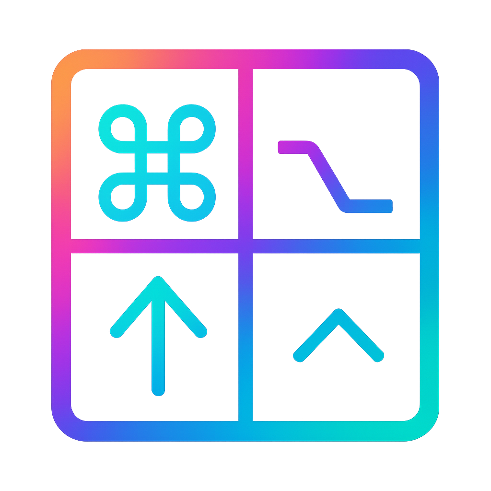

<p align="center">
  
</p>
<p align="center">
  <b>Ankura</b>
</p>

A type-safe configuration tool for [Karabiner-Elements](https://karabiner-elements.pqrs.org/) using Apple's [Pkl](https://pkl-lang.org/) configuration language.

ankura brings the power of Pkl to Karabiner-Elements configuration, allowing you to define keymaps in a declarative manner. Pkl provides autocomplete, type safety, validation, and excellent editor support that catches errors as you type. As a full programming language, Pkl lets you create your own abstractions and reusable patterns. You write simple, readable Pkl configurations that compile to Karabiner JSON. The live-reload daemon applies your changes instantly, making keyboard customization feel natural instead of painful.

**Features:**

- **Type-safe declarative DSL** - Write keyboard configurations in Pkl with full type checking, validation, documentation and editor support
- **Built-in helpers for common patterns** - Pre-built abstractions for hyper keys, symbol layers, key swaps, and dual-use keys
- **First-class macOS integrations** - Native support for popular window managers (yabai, AeroSpace) and system automation through shell commands
- **Live-reload daemon** - File watching with instant configuration updates

## Table of Contents

- [Installation](#installation)
- [Usage](#usage)
  - [Dual-Use Keys](#dual-use-keys)
  - [Simultaneous Layers](#simultaneous-layers)
  - [Layers](#layers)
  - [Simple Modifications](#simple-modifications)
  - [Actions](#actions)
  - [Built-ins](#built-ins)
- [Yabai Integration](#yabai-integration)
- [AeroSpace Integration](#aerospace-integration)

## Installation

```bash
# Install Karabiner-Elements if not already installed
brew install --cask karabiner-elements

# Install ankura
brew install lrangell/ankura/ankura
```

## Usage

Create or edit `~/.config/ankura.pkl`:

```pkl
extends "/opt/homebrew/var/lib/ankura/config.pkl"

name = "My Config"
keys = new Keys{}
actions = new Actions {}
mods = new Modifiers {}

rules = List(
  // Your rules go here
)
```

### Getting Started with Pkl

If you're new to Pkl, we recommend reading the [Pkl Language Reference](https://pkl-lang.org/main/current/language-reference/index.html) to understand the language fundamentals.

For the best experience, add Pkl support to your editor:

- **Neovim**: [pkl-neovim](https://github.com/apple/pkl-neovim)
- **VSCode**: [Pkl extension installation guide](https://pkl-lang.org/vscode/current/installation.html)

Editor support provides autocomplete, type checking, inline documentation, and error highlighting as you write your configurations.

### Layers

Create modal layers for complex workflows.

```pkl
new Layer {
  modifier = mods.ctrl
  h = keys.left
  j = keys.down
  k = keys.up
  l = keys.right
}
```

### Dual-Use Keys

Transform keys to behave differently when tapped vs held.

```pkl
new DualUse {
  key = keys.capsLock
  tap = keys.esc
  hold = keys.ctrl
}
```

### Simultaneous Layers

Activate arrow keys while holding a trigger.

```pkl
new SimLayer {
  trigger = "f"
  h = keys.left
  j = keys.down
  k = keys.up
  l = keys.right
}
```

### Simple Modifications

Basic key remapping.

```pkl
new BasicMap {
  key = keys.capsLock
  action = keys.esc
}
```

### SpaceMode

Space key + other keys for quick shortcuts.

```pkl
new SpaceMode {
  h = keys.left
  j = keys.down
  k = keys.up
  l = keys.right
  i = keys.del
  comma = keys.option.and(keys.comma)
  period = keys.option.and(keys.period)
  semicolon = keys.returnOrEnter
}
```

### Actions

Execute shell commands, launch applications, and control system functions.

```pkl
// Launch or focus application
new BasicMap {
  key = "s"
  mod = mods.cmd
  action = actions.focusOrLaunchApp("Slack")
}

// Run shell commands and open URLs
new SimLayer {
  trigger = "d"
  y = actions.runShell("/opt/homebrew/bin/yabai -m space --focus recent")
  u = actions.openUrl("https://example.com")
}

// Type text when held, normal key when tapped
new DualUse {
  key = keys.comma
  hold = actions.typeText("user@example.com")
  tap = keys.comma
}
```

<details>
<summary>Click to expand all available actions</summary>

#### Application Management

```pkl
actions.launchApp("Google Chrome")           // Launch application
actions.focusOrLaunchApp("Slack")            // Focus or launch if not running
actions.closeWindow()                        // Close current window (⌘W)
actions.closeApp()                           // Quit application (⌘Q)
```

#### Shell Commands

```pkl
actions.runShell("/opt/homebrew/bin/yabai -m space --focus recent")
actions.runBin("/usr/local/bin/custom-script", List("arg1", "arg2"))
actions.openUrl("https://example.com")
```

#### Text and Notifications

```pkl
actions.typeText("user@example.com")
actions.showNotification("Build Complete", "All tests passed!")
```

#### System Controls

```pkl
actions.lockScreen()                         // Lock screen
actions.sleep()                              // Put system to sleep
actions.volumeUp()                           // Increase volume
actions.volumeDown()                         // Decrease volume
actions.mute()                               // Toggle mute
actions.brightnessUp()                       // Increase brightness
actions.brightnessDown()                     // Decrease brightness
```

#### Screenshots

```pkl
actions.screenshot()                         // Screenshot to clipboard
actions.screenshotSelection()                // Screenshot selection
actions.screenshotWindow()                   // Screenshot window
```

#### Utilities

```pkl
actions.showLaunchpad()                      // Open Launchpad
actions.openActivityMonitor()                // Open Activity Monitor
```

</details>

### Built-ins

Pre-built patterns for common keyboard customizations.

```pkl
// Hyper key - map caps_lock to all four modifiers (⌃⌥⇧⌘)
builtins.hyperKey(keys.capsLock)

// Dual-use hyper key - ⌃⌥⇧⌘ when held, escape when tapped
builtins.hyperKeyDualUse(keys.capsLock)

// Symbol layer - hold right_shift for quick access to programming symbols
builtins.symbolLayer(keys.rightShift)

// Key swaps
builtins.swapKeys(keys.tab, keys.escape)  // swap tab and escape
builtins.swapSemicolon()                  // swap ; and :
```

For a complete working example with all features, see [readme_examples_profile.pkl](./readme_examples_profile.pkl).

## Yabai Integration

<details>
<summary>Click to expand yabai window management examples</summary>

Control yabai window manager directly from your keyboard:

```pkl
yabai {
  modifier = "d"
  window {
    focus {
      west = "h"
      south = "j"
      north = "k"
      east = "l"
    }

    swap {
      modifier = List(mods.cmd, mods.shift)
      west = "h"
      south = "j"
      north = "k"
      east = "l"
    }

    resize {
      modifier = List(mods.ctrl, mods.opt)
      left = "h"
      down = "j"
      up = "k"
      right = "l"
    }
  }

  space {
    focus {
      mappings {
        ["1"] = "u"
        ["2"] = "i"
        ["3"] = "o"
        ["4"] = "p"
        ["5"] = keys.openBracket
      }
      prev = "n"
      next = "m"
    }
  }

  display {
    focus {
      modifier = List(mods.cmd, mods.opt)
      mappings {
        ["1"] = "1"
        ["2"] = "2"
        ["3"] = "3"
      }
      prev = keys.comma
      next = keys.period
    }
  }

  toggles {
    modifier = List(mods.cmd, mods.opt, mods.shift)
    float = "f"
    fullscreen = "m"
    sticky = "s"
    zoom = "z"
  }
}
```

</details>

## AeroSpace Integration

<details>
<summary>Click to expand AeroSpace window management examples</summary>

Control AeroSpace tiling window manager with keyboard shortcuts:

```pkl
aerospace {
  modifier = "f"
  window {
    focus {
      left = "h"
      down = "j"
      up = "k"
      right = "l"
      dfsNext = "n"
      dfsPrev = "p"
    }

    move {
      left = "h"
      down = "j"
      up = "k"
      right = "l"
    }

    resize {
      modifier = List(mods.opt, mods.ctrl)
      width = "w"
      height = "h"
      smart = "s"
      amount = 100
    }

    layout {
      tiling = "t"
      floating = "f"
      fullscreen = "m"
    }
  }

  workspace {
    focus {
      mappings {
        ["1"] = "u"
        ["2"] = "i"
        ["3"] = "o"
      }
      next = keys.tab
      prev = "h"
    }

    move {
      modifier = List(mods.opt, mods.shift)
      mappings {
        ["1"] = "1"
        ["2"] = "2"
        ["3"] = "3"
      }
      prev = "n"
      next = "m"
    }
  }


}
```

</details>

---

Inspired by [GokuRakuJoudo](https://github.com/yqrashawn/GokuRakuJoudo)
